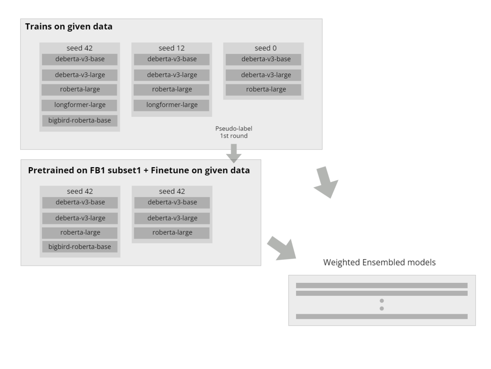

# feedback-prize-ell

This is repository for tracking my participation in [Feedback Prize - English Language Learning](https://www.kaggle.com/competitions/feedback-prize-english-language-learning/) kaggle competition  

Public LB: 168th  
Private LB: 192th (Bronze Medal)

## What works
> - Differential learning rates
> - Layer-wise learning rate decay
> - Cosine scheduler with 25% warmup of the first epoch (about 5% of all steps)
> - Reinitialzing last layer
> - Multi-sample dropout
> - Mean pooling on longformer
> - Concatnated attention head with mean pooling on others architectures
> - AWP
> - Pseudo labelling
> - Seeds blending
> - Mixing different max_len ensemble models
> - Optuna ensemble weight optimization

## What did not work
> - Gradient clipping
> - Ranger21 
> - Madgrad and MirrorMadGrad
> - Freeze some layers
> - SWA
# Models
| Models                                   | CV       |
| ---------------------------------------- | -------- |
| microsoft/deberta-v3-base (seed 42)      | 0.452696 |
| microsoft/deberta-v3-base (seed 12)      | 0.453501 |
| microsoft/deberta-v3-base (seed 0)       | 0.45297  |
| microsoft/deberta-v3-base (seed 42pl1)   | 0.451444 |
| microsoft/deberta-v3-base (seed 12pl1)   | 0.452189 |
| google/bigbird-roberta-base (seed 42)    | 0.460883 |
| google/bigbird-roberta-base (seed 12)    | 0.461839 |
| google/bigbird-roberta-base (seed 0)     | 0.461794 |
| google/bigbird-roberta-base (seed 42pl1) | 0.460131 |
| microsoft/deberta-v3-large (seed 42)     | 0.452084 |
| microsoft/deberta-v3-large (seed 12)     | 0.453944 |
| microsoft/deberta-v3-large (seed 0)      | 0.45297  |
| microsoft/deberta-v3-large (seed 42pl1)  | 0.45039  |
| microsoft/deberta-v3-large (seed 12pl1)  | 0.451133 |
| roberta-large (seed 42)                  | 0.457107 |
| roberta-large (seed 12)                  | 0.456173 |
| roberta-large (seed 0)                   | 0.456481 |
| roberta-large (seed 42pl1)               | 0.457107 |
| roberta-large (seed 12pl1)               | 0.456173 |
| allenai/longformer-large-4096 (seed 42)  | 0.45473  |
| allenai/longformer-large-4096 (seed 12)  | 0.453414 |

pl1: pseudo-labels 1 round

## Ensemble
For full submissions table [see here](submission_ranking.csv)
- Best submission (Did not select)
    - 10 models, 4 different architectures.
        - **deberta-v3-base 2 seeds (12, 0)**
        - **deberta-v3-base pseudo-labels seed 42**
        - **bigbird-roberta-base pseudo-labels seed 42**
        - **deberta-v3-large 2 seeds (42, 12)**
        - **deberta-v3-large pseudo-labels seed 42**
        - **roberta-large 2 seeds (42, 12)**
        - **longformer-large seed 12**
    - Weighted ensembled CV: **0.4454052**
    - Public LB: 0.437664
    - Private LB: 0.436382

- 2nd best submission (**SELECTED**)
    - 14 models, 5 different architectures.
        - **deberta-v3-base seed 0**
        - **deberta-v3-base pseudo-labels 2 seeds (42, 12)**
        - **deberta-v3-large 3 seeds (42, 12, 0)**
        - **deberta-v3-large pseudo-labels 2 seeds (42, 12)**
        - **bigbird-roberta-base pseudo-labels seed 42**
        - **roberta-large pseudo-labels seed 42**
        - **roberta-large 2 seeds (12, 0)**
        - **longformer-large 2 seeds (42, 12)**
    - Weighed ensembled cv: ***0.4450627*** 
    - Public LB: 0.437602
    - Private LB: 0.436404

- 3rd best submission (**SELECTED**)
    - 21 models, 5 different architectures.
        - **deberta-v3-base 3 seeds (42, 12, 0)**
        - **deberta-v3-base pseudo-labels 2 seeds (42, 12)**
        - **deberta-v3-large 3 seeds (42, 12, 0)**
        - **deberta-v3-large pseudo-labels 2 seeds  (42 ,12)**
        - **bigbird-roberta-base 3 seeds (42, 12, 0)**
        - **bigbird-roberta-base pseudo-labels 1 seed (42)**
        - **roberta-large 3 seeds (42, 12, 0)**
        - **roberta-large pseudo-labels 2 seeds (42, 12)**
        - **longformer-large-4096 2 seeds (42, 12)**
    - Weighted ensembled CV: **0.4449692**
    - Public LB: 0.437734
    - Private LB: 0.436439

<!--  -->

# Notebooks
These notebooks can run on google colab by using your kaggle api and google drive.  
I have not look over the code again after competition ended. There might be some bugs.  
I will clean up code and turn them into script file later.  
1. [fb_ell_trainb](notebook/fb_ell_trainnb.ipynb) &rarr; train model.
1. [fb_ell_mk_pseudo_label](notebook/fb_ell_trainnb_mk_pseudo_label.ipynb) &rarr; generate pseudo-labels in leak-free manner. (using subset of the first feedback competitions)
1. [fb_ell_pretrain_pseudo_label](notebook/fb_ell_trainnb_pretrain_pseudo_label.ipynb) &rarr; pretrain model on generated pseudo-labels.
1. [fb_all_finetune_pseudo_label](notebook/fb_ell_trainnb_finetune_pseudo_label.ipynb) &rarr; finetune the  pretrained models.
1. [fb_ell_cal_cv_nb](notebook/fb_ell_cal_cv_nb.ipynb) &rarr; generate out of fold prediction and calculate ensembled models score.
1. inference notebook &rarr; coming soon